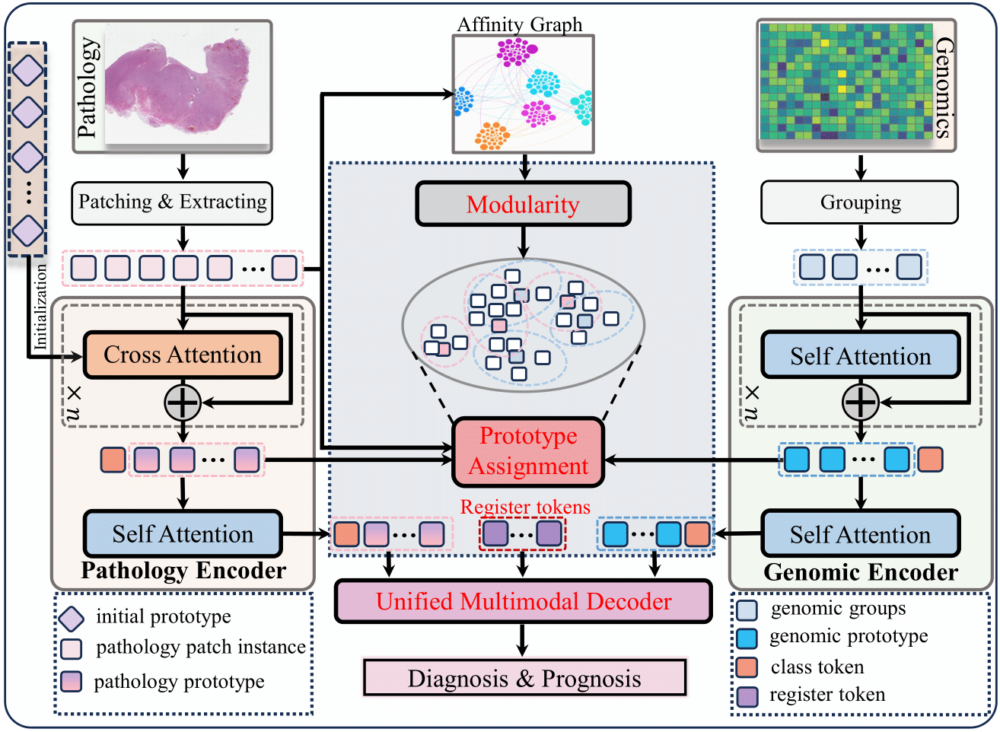

<br />
<p align="center">
  <h1 align="center">Unified Modeling Enhanced Multimodal Learning for Precision Neuro-Oncology</h1>
  <p align="center">
    <br />
    <a><strong>Huahui Yi*</strong></a>
    ·
    <a><strong>Xiaofei Wang*</strong></a>
    .
   <a><strong>Kang Li</strong></a>
    .
    <a ><strong>Chao Li</strong></a>
  </p>

  <p align="center">
    <a href=''>
      
    </a>
  </p>
<br />

## UMEML
<p align="center">
     <br />
</p>

## Installation
a. Create a conda virtual environment and activate it.

```bash
# Create a conda environment
conda create -n mmdp python=3.10

# Activate the environment
conda activate mmdp
```

b. Install PyTorch and torchvision following the [official instructions](https://pytorch.org/), e.g.,

```shell
# CUDA 11.7
conda install pytorch==1.13.0 torchvision==0.14.0 torchaudio==0.13.0 pytorch-cuda=11.7 -c pytorch -c nvidia

c. Install this library 
```bash
# Enter the folder
cd MMSP/

# Install dependencies
pip install -r requirements.txt

# Install this library (no need to re-build if the source code is modified)
python setup.py develop
```

## Citation

If you think UMEML codebase are useful for your research, please consider referring us:


```bibtex

```
